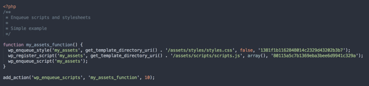

# gulp-wp-rev
<p align="left">
  <a href="https://www.npmjs.com/package/gulp-wp-rev"></a>
  <a href="https://github.com/raulghm/gulp-wp-rev/stargazers"></a>
</p>

> gulp-wp-rev plugin for [gulp](https://github.com/wearefractal/gulp)

Revisioning CSS/JS appending a hash in you assets of wordpress theme.

`styles.css?ver=1` → `styles.css?ver=bd0622b828f9346876088cd617566fa5`



## Usage

First, install `gulp-wp-rev` as a development dependency:

```shell
npm install --save-dev gulp-wp-rev
```

Then, add it to your `gulpfile.js`:

```javascript
var wpRev = require('gulp-wp-rev');

gulp.task('rev', function() {
	gulp.src('./wp-content/themes/raulghm-theme/lib/scripts.php')
	.pipe(wpRev({
		css: 'src/styles/styles.css',
		cssHandle: 'my_assets',
		js: 'src/scripts/scripts.js',
		jsHandle: 'my_assets'
	}))
	.pipe(gulp.dest('./wp-content/themes/raulghm-theme/lib'));
});
```

## API

### wp-rev(options)

#### options.css
Type: `String`  

css source file

#### options.js
Type: `String`  

js source file

#### options.cssHandle
Type: `String`  

Name used as a handle for the stylesheet.

#### options.jsHandle
Type: `String`  

Name used as a handle for the javascript.


## License

MIT © [raulghm](https://github.com/raulghm)
